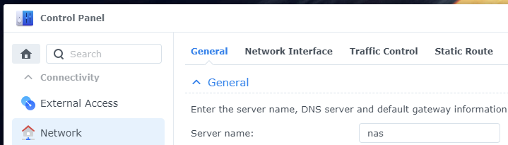
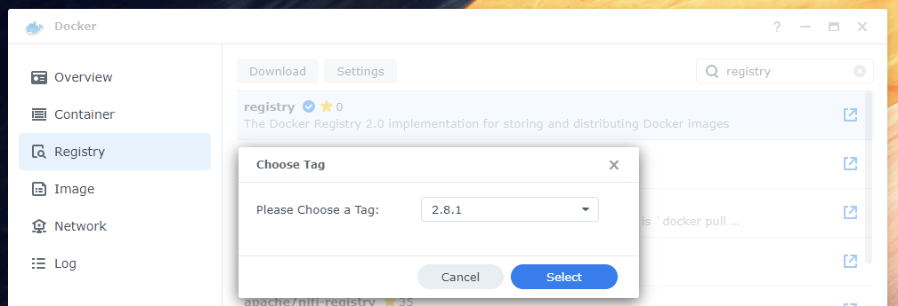
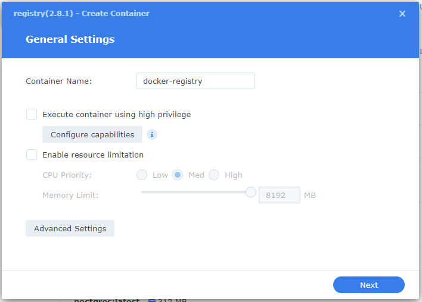
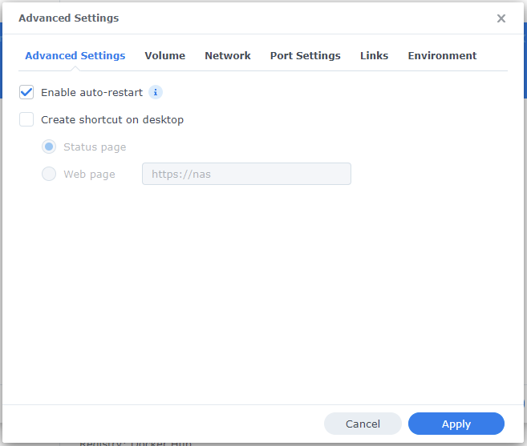
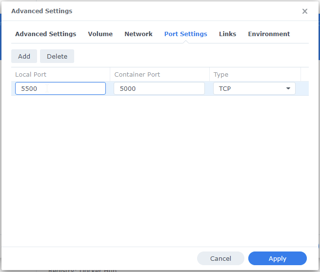
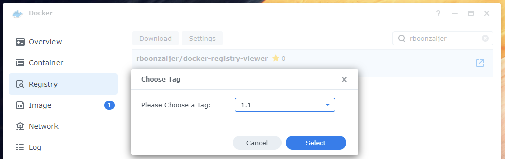
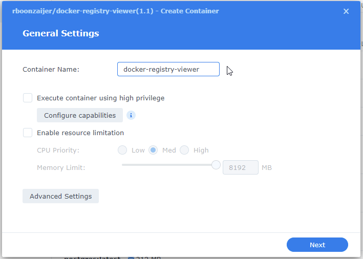
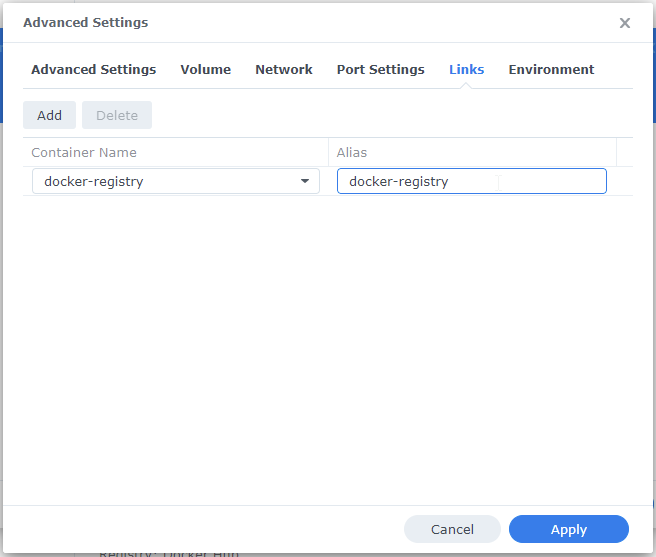
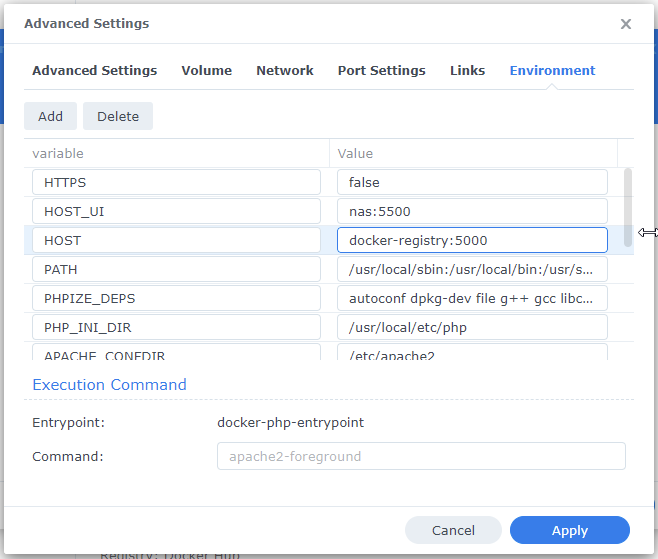
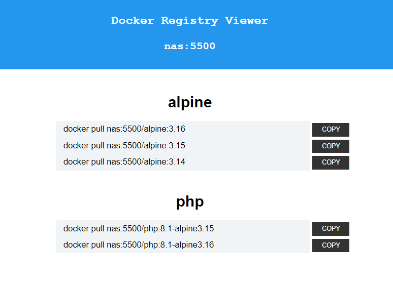

# Docker Registry Viewer

-  List all your docker images and tags from your private registry in one simple overview

# Synology NAS (DSM 7) - Private Docker Registry

### (for localhost install, check out: [readme.md](readme.md)

- This guide assumes your Synology NAS hostname is 'nas'
- The registry will be available at http://nas:5500
- The viewer will be available at http://nas:8500



- Download the 'registry' image



- Create a container by double clicking on the image
- Name the container 'docker-registry'



- At 'Advanced Settings': make sure the 'Enable auto-restart' is checked



- At 'Port Settings': set the local port to 5500



- Now start the container and you already have your private registry up and running!


# Docker Registry Viewer

- Download the image 'rboonzaijer/docker-registry-viewer'



- Create a container by double clicking on the image
- Name the container 'docker-registry-viewer'



- At 'Advanced Settings': make sure the 'Enable auto-restart' is checked


- At 'Port Settings': set the local port to 8500


- At 'Links': Click on 'Add'
- Locate the docker container named 'docker-registry' and select it
- For convenience: give it the same alias name as the container name ('docker-registry')



- At 'Environment':
- Add at least the required variables: HOST + HOST_UI.

| KEY     | VALUE                 | REQUIRED | DESCRIPTION |
| ------- | --------------------- | -------- | ----------- |
| HOST    | docker-registry:5000  | YES      | The internal hostname and port that the viewer uses to connect to the registry container (note: port 5000!) |
| HOST_UI | nas:5500              | YES      | Will be used for displaying and to quickly copy a pull command to the clipboard                             |
| HTTPS   | true or false         | -        | Will be used to call the api ( http://nas:5500/v2/_catalog or https://nas:5500/v2/_catalog )                |



- Now start this container

# Update Docker settings

- Docker Desktop > Settings > Docker Engine

```
"insecure-registries": [
	"nas:5500"
],
```

# Upload some images to your registry
```
docker pull alpine:3.16 && \
docker pull alpine:3.15 && \
docker pull alpine:3.14 && \
docker pull php:8.1-alpine3.15 && \
docker pull php:8.1-alpine3.16 && \
docker image tag alpine:3.16 nas:5500/alpine:3.16 && \
docker image tag alpine:3.15 nas:5500/alpine:3.15 && \
docker image tag alpine:3.14 nas:5500/alpine:3.14 && \
docker image tag php:8.1-alpine3.15 nas:5500/php:8.1-alpine3.15 && \
docker image tag php:8.1-alpine3.16 nas:5500/php:8.1-alpine3.16 && \
docker push nas:5500/alpine:3.16 && \
docker push nas:5500/alpine:3.15 && \
docker push nas:5500/alpine:3.14 && \
docker push nas:5500/php:8.1-alpine3.15 && \
docker push nas:5500/php:8.1-alpine3.16
```

- Navigate to the Docker Registry Viewer: [http://nas:8500](http://nas:8500)




# Usage in Dockerfile: link to your own registry:
```
FROM nas:5500/php:8.1-alpine3.16
...
```
