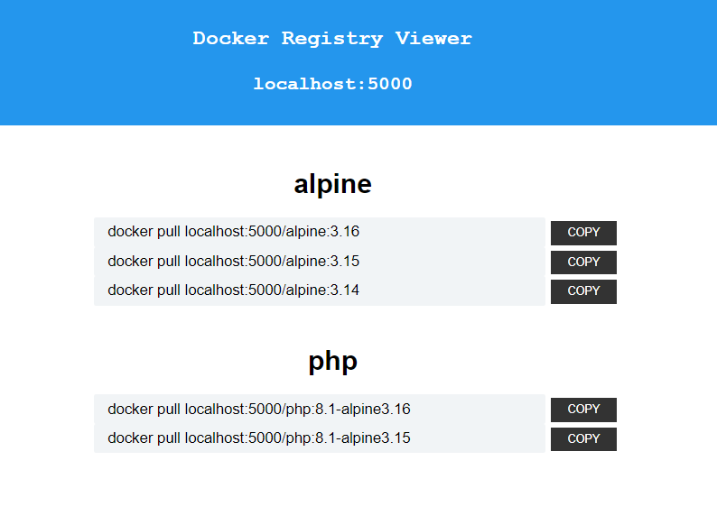

# Docker Registry Viewer

-  List all your docker images and tags from your private registry in one simple overview

# Installation on localhost (Docker Desktop)

### (for Synology NAS install, check out: [readme-synology.md](readme-synology.md)



### Usage in Dockerfile: link to your own registry:
```
FROM localhost:5000/php:8.1-alpine3.16
...
```


# Run a private docker registry
```
docker run -d \
	--restart always \
	-p 5000:5000 \
	--name docker-registry \
	registry:latest
```


# Run the 'Docker Registry Viewer'

```
docker run -d \
	--restart always \
	-p 8500:80 \
	--name docker-registry-viewer \
	--link docker-registry \
	-e HOST=docker-registry:5000 \
	-e HOST_UI=localhost:5000 \
	-e HTTPS=false \
	rboonzaijer/docker-registry-viewer:latest
```


# Upload some images to your registry
- And remove them locally again once they are pushed to the private registry...
```
docker pull alpine:3.16
docker image tag alpine:3.16 localhost:5000/alpine:3.16
docker push localhost:5000/alpine:3.16
docker rmi localhost:5000/alpine:3.16
docker rmi alpine:3.16

docker pull alpine:3.15
docker image tag alpine:3.15 localhost:5000/alpine:3.15
docker push localhost:5000/alpine:3.15
docker rmi localhost:5000/alpine:3.15
docker rmi alpine:3.15

docker pull alpine:3.14
docker image tag alpine:3.14 localhost:5000/alpine:3.14
docker push localhost:5000/alpine:3.14
docker rmi localhost:5000/alpine:3.14
docker rmi alpine:3.14

docker pull php:8.1-alpine3.15
docker image tag php:8.1-alpine3.15 localhost:5000/php:8.1-alpine3.15
docker push localhost:5000/php:8.1-alpine3.15
docker rmi localhost:5000/php:8.1-alpine3.15
docker rmi php:8.1-alpine3.15

docker pull php:8.1-alpine3.16
docker image tag php:8.1-alpine3.16 localhost:5000/php:8.1-alpine3.16
docker push localhost:5000/php:8.1-alpine3.16
docker rmi localhost:5000/php:8.1-alpine3.16
docker rmi php:8.1-alpine3.16
```

- Navigate to the Docker Registry Viewer: [http://localhost:8500](http://localhost:8500)

### (for Synology NAS install, check out: [readme-synology.md](readme-synology.md)
